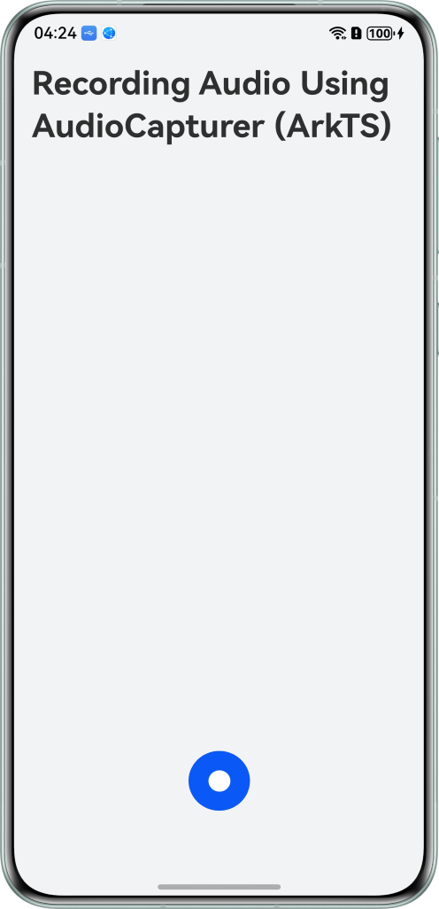
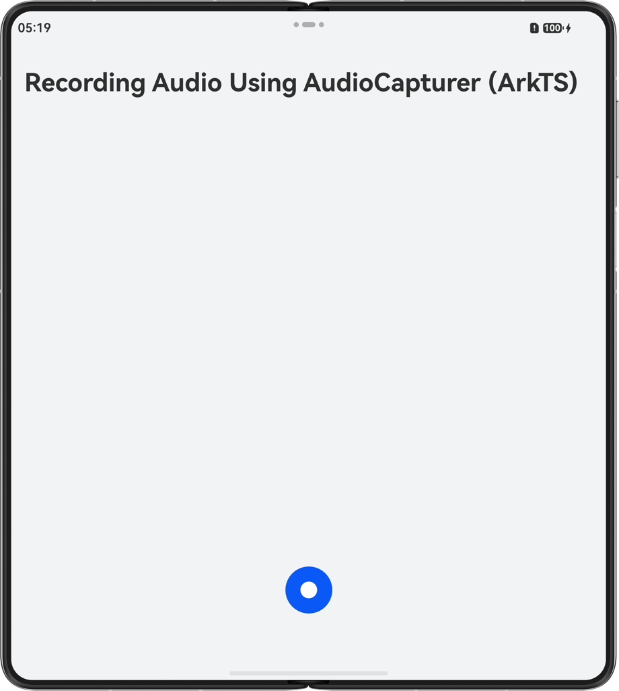
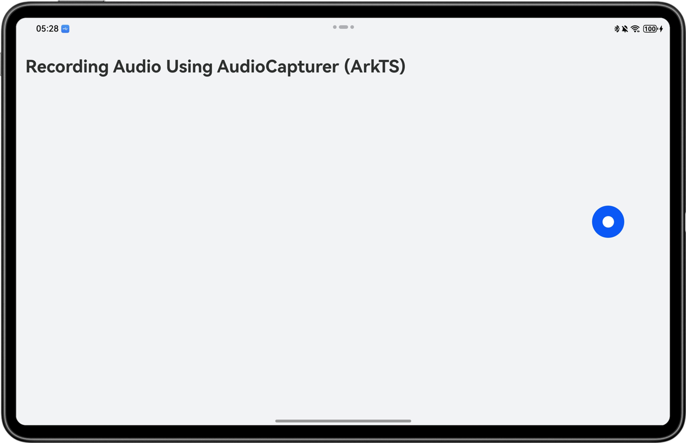

# Recording Audio Using AudioCapturer (ArkTS)

## Overview

This sample shows how to record Pulse Code Modulation (PCM) audio using AudioCapturer (ArkTS), which is suitable if you want to implement more flexible recording features.

## Preview

| Bar phone                                                   | Bi-fold phone                                                  | Tablet                                                            |
|-------------------------------------------------------------|----------------------------------------------------------------|-------------------------------------------------------------------|
|  |  |  |

## How to Use

1. Open the app and tap the recording button to start recording audio.
2. After the recording is complete, return to the home page and tap the audio file to play it.

## Project Directory

```
├──ets                                   // UI layer. 
│  ├──common                             // Common modules. 
│  │  └──Constants.ets                   // Constants. 
│  ├──components                   
│  │  └──RecordDialog.ets                // Recording dialog page. 
│  ├──controller                         // Controller module. 
│  │  ├──AudioCapturerController.ets     // Audio capture class of AudioCapturer. 
│  │  └──AudioRendererController.ets     // Playback class of AudioRenderer. 
│  ├──entryability                       // App entry function. 
│  │  └──EntryAbility.ets 
│  ├──entrybackupability 
│  │  └──EntryBackupAbility.ets 
│  ├──model 
│  │  └──RecordFileInfo.ets              // Recorded file data. 
│  ├──pages 
│  │  └──Index.ets                       // Home page. 
│  └──utils                              // Component modules. 
│     ├──BackgroundTaskUtil.ets          // Background task utility. 
│     ├──Logger.ets                      // Log utility. 
│     ├──PermissionUtil.ets              // Permission utility. 
│     └──StringUtil.ets                  // String utility. 
├──resources                             // Static resources. 
└──module.json5                          // Module configuration.
```

## How to Implement

1. Create an AudioCapturer object when the recording page is displayed.
2. Configure AudioCapturer, including the audio data and callback function.
3. Enable AudioCapturer to start audio recording.
4. Tap the button to complete the recording.

## Required Permissions

1. ohos.permission.MICROPHONE: allows an app to use the microphone.
2. ohos.permission.KEEP_BACKGROUND_RUNNING: allows an app to apply for a continuous task of the special type.

## Constraints

1. This sample is only supported on bar-type phones, bi-fold devices (Mate X series), tri-fold devices, widescreen foldable devices, tablets, PCs running standard systems.
2. The HarmonyOS version must be HarmonyOS 6.0.2 Release or later.
3. The DevEco Studio version must be DevEco Studio 6.1.0 Release or later.
4. The HarmonyOS SDK version must be HarmonyOS 6.1.0 Release SDK or later.